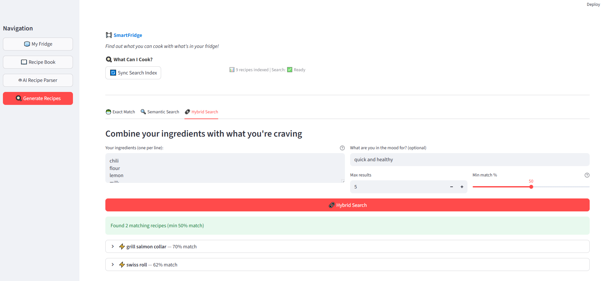
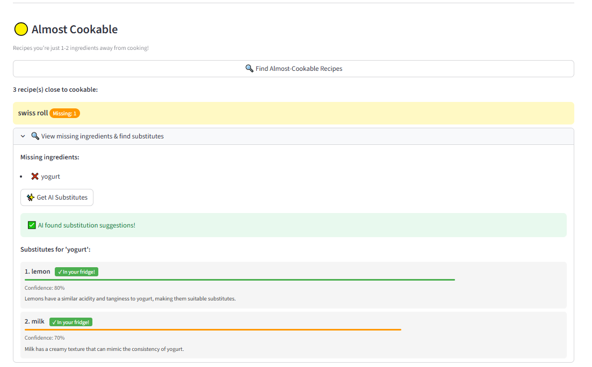
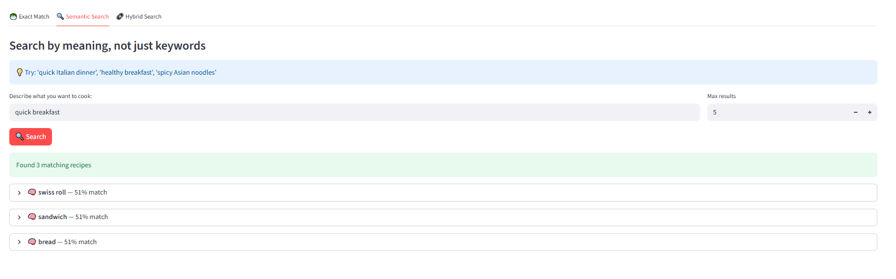
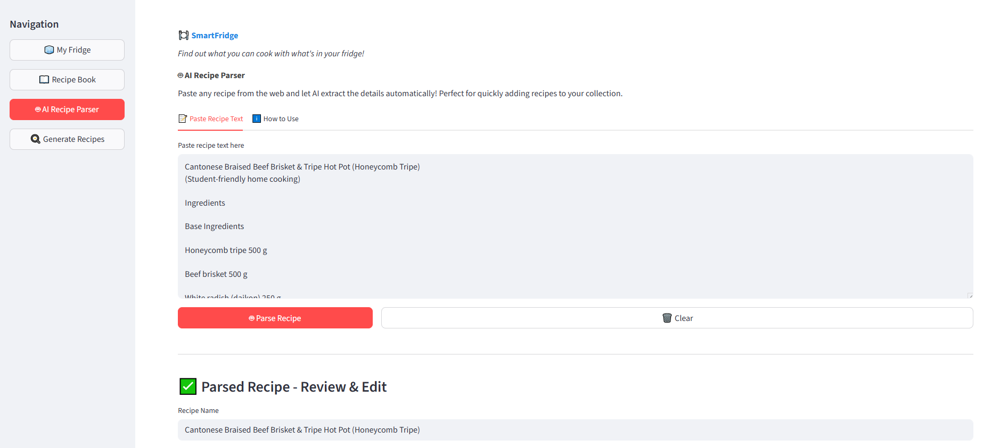
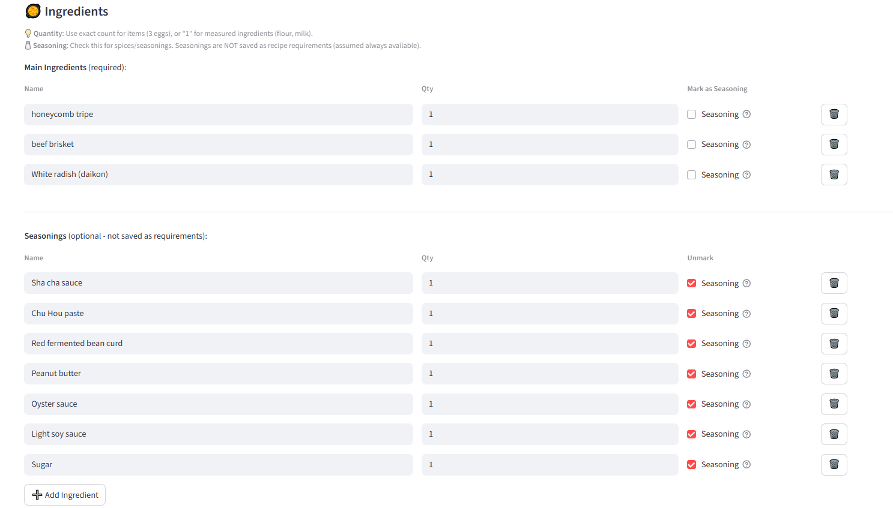
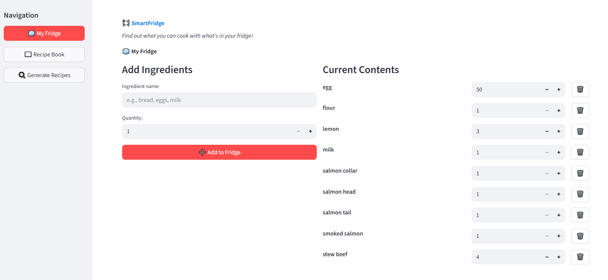
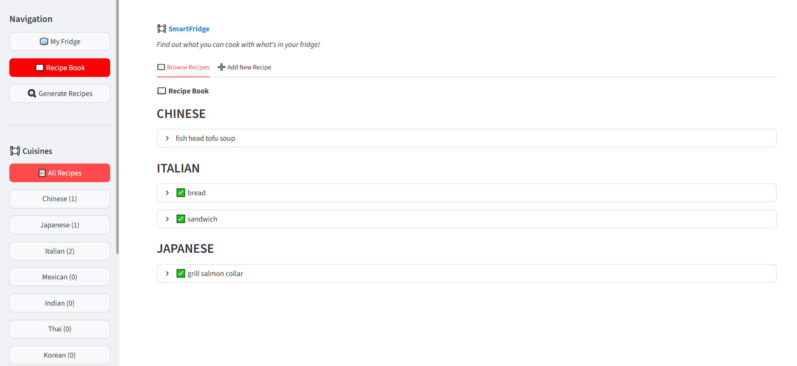
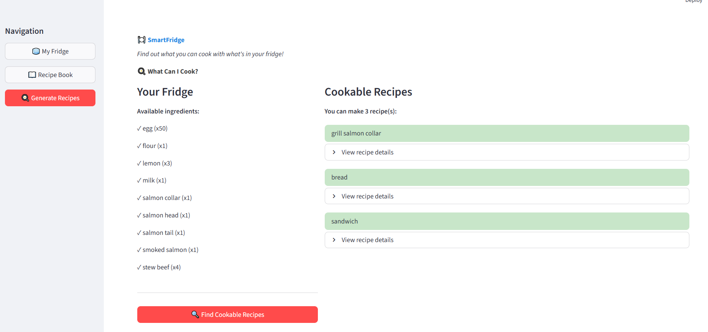

# 🧊 SmartFridge

> **"What can I cook tonight?"** — Let AI figure it out.

A full-stack smart kitchen assistant that discovers recipes from your fridge ingredients. Powered by **semantic search**, **AI substitutions**, and **hybrid retrieval** — never waste food again.

### ✨ Key Features
- 🔍 **Hybrid Search** — Find recipes by ingredients + natural language ("something quick with chicken")
- 🤖 **AI Substitutions** — Missing an ingredient? Get smart alternatives from your fridge
- 🧠 **Semantic Understanding** — Search by meaning, not just keywords
- 📖 **Recipe Parser** — Paste any recipe, AI extracts ingredients automatically
- 🥕 **Fridge Tracker** — Manage what you have, find what you can make

---
## 🚀 What's New

### v2.3 - Hybrid Search with RRF Fusion



**New Features:**
- ⚡ **True Hybrid Search** - Combines semantic meaning + keyword matching using Reciprocal Rank Fusion (RRF)
- 🎯 **Score Threshold Filter** - Slider to filter out low-relevance results (0-100%)
- 🧠 **Multi-Vector Architecture** - Each recipe stored with dense (semantic) + sparse (keyword) vectors

**Technical:**
- Qdrant's `prefetch` API with dual queries
- BM25-style sparse vectors for ingredient matching
- Eliminates semantic drift from template patterns

---

### v2.2 - Ingredient Substitution Recommendations



**New Features:**
- 🔄 **AI Substitution Suggestions** - When ingredients are missing, AI suggests alternatives from your fridge
- 📊 **Almost Cookable Recipes** - Find recipes you're close to making
- 🧪 **Missing Ingredient Analysis** - See exactly what you need

---

### v2.1 - Semantic Search & Ingredient Aliases



**New Features:**
- 🔍 **Semantic Search** - Find recipes by meaning, not just keywords ("something healthy" → salads)
- 🏷️ **Canonical Names & Aliases** - Auto-mapping ingredient variants
  - `roma tomato` → canonical: `tomato`
  - AI-generated aliases for new ingredients
- 📊 **Vector Database** - Qdrant stores recipe embeddings for similarity search

**Technical:**
- Ollama `nomic-embed-text` for 768-dim embeddings
- Qdrant vector database integration

---

### v2.0 - AI-Powered Recipe Parser




**New Features:**
- 🤖 **AI Recipe Parser** - Paste any recipe text, AI extracts ingredients, seasonings, and instructions
- 🧂 **Ingredient vs Seasoning Separation** - Seasonings don't count towards recipe requirements
- 📊 **Improved UI** - Better recipe display with separate ingredient/seasoning sections

**Technical Improvements:**
- Ollama integration for local LLM (llama3.2:1b)
- Database schema: `is_seasoning` column for proper separation

---

### v1 - Full-Stack Foundation





**Features:**
- 🥕 **Fridge Management** - Add/remove ingredients with quantities
- 📖 **Recipe Book** - Browse recipes by cuisine, add custom recipes
- 🍳 **Smart Recipe Generation** - Find cookable recipes using Kahn's algorithm
- 💾 **Local Persistence** - SQLite database, fully offline

---

## Tech Stack

| Layer | Technology |
|-------|------------|
| Frontend | Python 3.10+, Streamlit |
| AI Service | Python Flask (port 5001) |
| Backend | Java 17, Spring Boot 3.2 |
| Database | SQLite (relational), Qdrant (vector) |
| AI | Ollama (LLM + embeddings) |


---

## Quick Start

### Prerequisites
- Java 17+
- Maven
- Python 3.10+
- Docker Desktop
- Ollama ([install](https://ollama.ai))

### 1. Start External Services

**Qdrant (Vector Database)**
```bash
docker run -d -p 6333:6333 -p 6334:6334 \
  -v qdrant_storage:/qdrant/storage \
  --name smartfridge-qdrant \
  qdrant/qdrant
```

**Ollama (AI Models)**
```bash
# Start Ollama (runs as background service on Windows)
ollama serve

# Pull required models (first time only)
ollama pull llama3.2:1b        # For recipe parsing & substitutions
ollama pull nomic-embed-text   # For semantic embeddings
```

### 2. Start Application Services

Open **4 separate terminals**:

**Terminal 1: Spring Boot Backend**
```bash
cd SmartFridge
mvn spring-boot:run
# Runs on http://localhost:8080
```

**Terminal 2: Flask AI Service**
```bash
cd SmartFridge/frontend
pip install -r requirements.txt
python ai_service.py
# Runs on http://localhost:5001
```

**Terminal 3: Streamlit Frontend**
```bash
cd SmartFridge/frontend
streamlit run app.py
# Runs on http://localhost:8501
```

### 3. Post-Setup (First Run)

1. Open **http://localhost:8501**
2. Go to **Search** → **Admin** tab
3. Click **"📊 Index All Recipes"** to populate Qdrant
4. Wait for indexing to complete (~30 seconds)

### Service URLs
| Service | URL | Purpose |
|---------|-----|---------|
| Frontend | http://localhost:8501 | Streamlit UI |
| Backend API | http://localhost:8080/api | Spring Boot REST |
| AI Service | http://localhost:5001 | Flask (substitutions, parsing) |
| Qdrant | http://localhost:6333 | Vector database dashboard |

### Run with Docker (All-in-One)
```bash
docker-compose build
docker-compose up -d
```
> Note: Still requires Ollama running on host machine

---

## API Endpoints

### Core Recipe & Fridge
| Method | Endpoint | Description |
|--------|----------|-------------|
| GET | `/api/fridge` | Get fridge contents with quantities |
| POST | `/api/fridge/{item}` | Add item to fridge |
| PUT | `/api/fridge/{item}` | Update item count |
| DELETE | `/api/fridge/{item}` | Remove item |
| GET | `/api/recipes` | Get all recipes by cuisine |
| GET | `/api/recipes/{name}` | Get recipe details |
| POST | `/api/recipes` | Add new recipe |
| DELETE | `/api/recipes/{name}` | Delete recipe |
| GET | `/api/generate` | Generate cookable recipes |

### Search & Discovery
| Method | Endpoint | Description |
|--------|----------|-------------|
| GET | `/api/recipes/search` | Semantic search (query + limit) |
| POST | `/api/recipes/hybrid-search` | Hybrid search (ingredients + query + threshold) |
| GET | `/api/recipes/almost-cookable` | Find recipes with few missing ingredients |
| POST | `/api/search/index-all` | Re-index all recipes to Qdrant |
| GET | `/api/search/stats` | Vector search statistics |

### Ingredients & Substitutions
| Method | Endpoint | Description |
|--------|----------|-------------|
| GET | `/api/recipes/{name}/missing` | Get missing ingredients |
| GET | `/api/recipes/{name}/substitutions` | AI substitution suggestions |
| GET | `/api/ingredients/{name}/aliases` | Get ingredient aliases |
| POST | `/api/ingredients/{name}/generate-aliases` | AI-generate aliases |

### AI Service (Flask - port 5001)
| Method | Endpoint | Description |
|--------|----------|-------------|
| POST | `/ai/substitutions` | Get ingredient substitutions |
| POST | `/ai/parse-recipe` | Parse recipe text with AI |
| GET | `/health` | Health check |

---

## Project Structure
```
SmartFridge/
├── src/main/java/com/smartfridge/
│   ├── controller/
│   │   └── RecipeController.java    # All REST endpoints
│   ├── service/
│   │   ├── RecipeService.java       # Core recipe logic
│   │   ├── VectorSearchService.java # Qdrant hybrid search
│   │   ├── EmbeddingService.java    # Dense embeddings (Ollama)
│   │   ├── SparseEmbeddingService.java # BM25 sparse vectors
│   │   ├── IngredientResolver.java  # Alias resolution
│   │   └── IngredientSubstitutionService.java
│   ├── dao/
│   │   ├── RecipeDao.java           # Recipe CRUD
│   │   ├── SupplyDao.java           # Fridge management
│   │   ├── IngredientAliasDao.java  # Alias storage
│   │   └── DatabaseInitializer.java
│   └── model/                       # Data models
├── frontend/
│   ├── app.py                       # Streamlit main entry
│   ├── api.py                       # Backend API client
│   ├── ai_service.py                # Flask AI service (port 5001)
│   ├── ollama_client.py             # Ollama integration
│   └── views/
│       ├── fridge.py                # Fridge management UI
│       ├── recipes.py               # Recipe book UI
│       ├── generate.py              # Recipe generation UI
│       ├── search.py                # Semantic/hybrid search UI
│       └── recipe_parser.py         # AI recipe parser UI
├── docker-compose.yml               # Multi-container setup
└── pics/                            # Screenshots
```

---

## License
MIT
